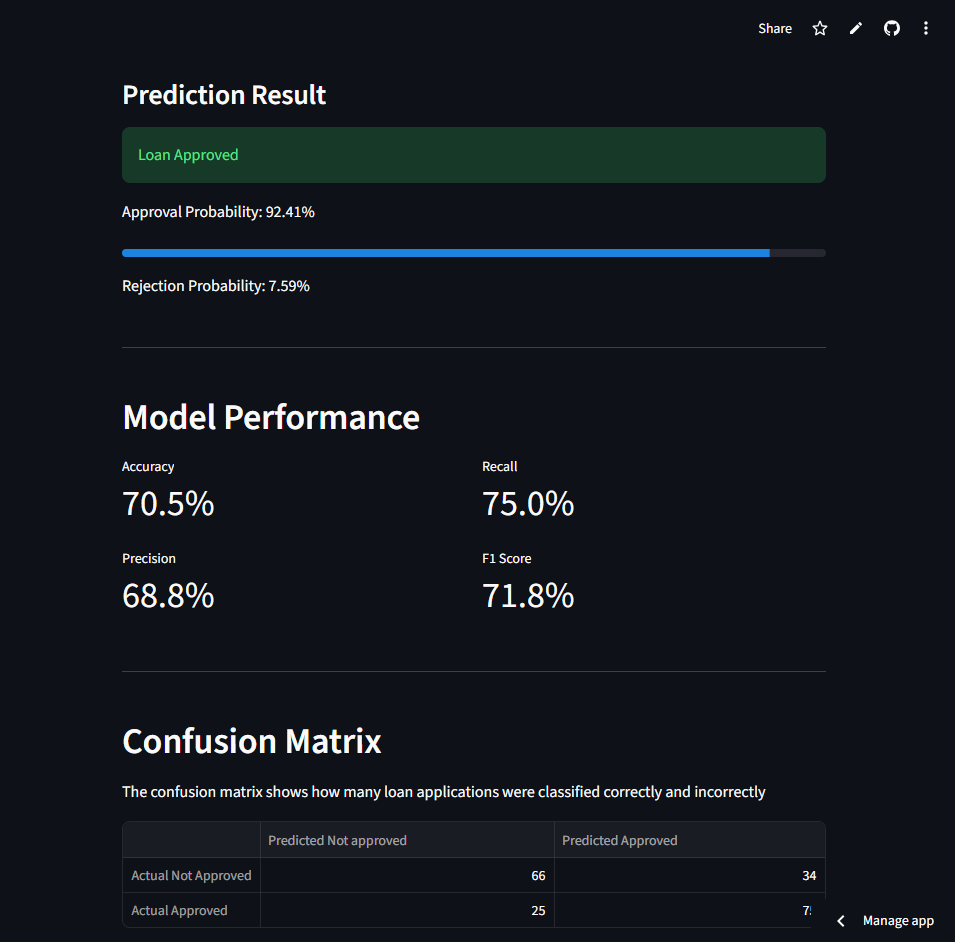

## Live Demo

Try the deployed Streamlit application here:

[Loan Approval Predictor](https://loan-approval-predictor-beiogrjbzfestggq3nuahy.streamlit.app/)

## Application Preview



# Loan Approval Predictor

A machine learning application that predicts whether a loan application is likely to be approved based on applicant information.

The project has two versions:

* **Phase 1:** Terminal-based ML application
* **Phase 2:** Streamlit web application

## Objective

Build a machine learning system that predicts loan approval using applicant financial and credit information.

## Features

* Monthly income
* Credit score
* Debt-to-income ratio
* Employment years
* Loan amount
* Prior defaults

## Machine Learning

The project compares three classification algorithms:

1. Logistic Regression
2. Decision Tree
3. Random Forest

Based on the current dataset:

| Model               | Accuracy |
| ------------------- | -------: |
| Logistic Regression |    70.5% |
| Decision Tree       |    57.0% |
| Random Forest       |    67.5% |

**Selected model: Logistic Regression**

## Phase 1 — Terminal Application

The terminal version allows users to enter applicant information and receive a loan approval prediction.

Run:

```bash
python predict.py
```

## Phase 2 — Streamlit Application

The advanced version provides a web interface for entering applicant information and displaying:

* Loan prediction
* Approval probability
* Rejection probability
* Accuracy
* Precision
* Recall
* F1-score
* Confusion matrix

Run:

```bash
streamlit run app.py
```

The application will open in your browser.

## Project Structure

```text
Loan-Approval-Predictor/
│
├── data/
│   └── loan.csv
│
├── inspect_data.py
├── train.py
├── predict.py
├── evaluate.py
├── compare_models.py
├── utils.py
├── app.py
├── loan_model.joblib
├── requirements.txt
├── .gitignore
└── README.md
```

## Installation

Clone the repository:

```bash
git clone https://github.com/Himanshu2296/Loan-Approval-Predictor.git
```

Move into the project:

```bash
cd Loan-Approval-Predictor
```

Install dependencies:

```bash
pip install -r requirements.txt
```

## Train the Model

```bash
python train.py
```

The best-performing model will be saved as:

```text
loan_model.joblib
```

## Evaluate the Model

```bash
python evaluate.py
```

This calculates:

* Accuracy
* Precision
* Recall
* F1-score
* Confusion matrix

## Run the Streamlit Application

```bash
streamlit run app.py
```

## Technologies

* Python
* Pandas
* Scikit-learn
* Logistic Regression
* Joblib
* Streamlit
* Git
* GitHub

## Future Improvements

* Hyperparameter tuning
* Cross-validation
* Better feature preprocessing
* More extensive model comparison
* Explainable AI
* Improved UI/UX
* Cloud deployment

## Disclaimer

This project is created for educational purposes. Its predictions should not be used as the sole basis for real financial or lending decisions.
